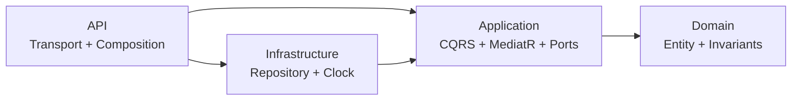

# نمونه کامل SDD

این پروژه همان مسئله نمونه Vibe را با مرجع حقیقت، مرز اختیار و شواهد اجرایی پیاده می‌کند.

## مسیر خواندن در ارائه

1. `specs/001-user-profile/spec.md`: مسئله، دقیقاً شش property و رفتار قابل مشاهده.
2. `specs/001-user-profile/clarifications.md`: تصمیم‌هایی که Agent حق حدس‌زدن آن‌ها را ندارد.
3. `.specify/memory/constitution.md`: اصول پایدار.
4. `AGENTS.md`: قواعد عملیاتی عامل.
5. `specs/001-user-profile/plan.md`: Onion، CQRS/MediatR و Repository.
6. `specs/001-user-profile/tasks.md`: کارهای کوچک و ردیابی‌پذیر.
7. `specs/001-user-profile/traceability.md`: اتصال requirement به code و test.
8. `specs/001-user-profile/evidence.md`: نتیجه واقعی اجرا.

## معماری



وابستگی‌ها فقط به سمت داخل‌اند. endpoint تنها `ISender` را می‌شناسد؛ handler تنها interfaceهای Application را؛ Repository adapter در Infrastructure قرار دارد.

## اجرا

```powershell
dotnet restore .\UserProfiles.Sdd.slnx --configfile .\NuGet.Config
dotnet build .\UserProfiles.Sdd.slnx --no-restore
dotnet test .\UserProfiles.Sdd.slnx --no-build
dotnet run --project .\src\UserProfiles.Api --no-build --urls http://localhost:5071
```

درخواست‌های آماده در `src/UserProfiles.Api/UserProfiles.Api.http` قرار دارند.

## ترتیب دموی ۱۰ دقیقه‌ای

1. ۶۰ ثانیه: Spec و شش property.
2. ۶۰ ثانیه: Clarification؛ ایمیل، تلفن، سن، کشور و scope.
3. ۶۰ ثانیه: Constitution و AGENTS.
4. ۹۰ ثانیه: Plan و نمودار Onion.
5. ۹۰ ثانیه: command/handler و Repository port/adapter.
6. ۱۲۰ ثانیه: سه درخواست 201، 409 و 400.
7. ۶۰ ثانیه: test و architecture check.
8. ۳۰ ثانیه: traceability و evidence.

## محدودیت صریح

Repository این نسخه process-local و in-memory است. با restart داده حذف می‌شود و در چند instance مشترک نیست. این محدودیت پنهان نشده است؛ database persistence یک feature جدا با Spec و Plan مخصوص خود خواهد بود.
